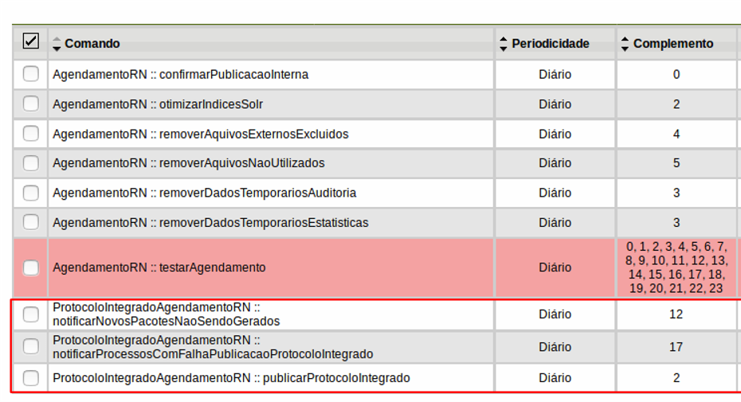

# Manual de Instalação do Módulo Protocolo Integrado - PI

Este documento apresenta um manual para a instalação do Módulo do Protocolo Integrado 2.0.1, que permite ao SEI enviar metadados dos processos e suas tramitações para o sistema Protocolo Integrado (protocolointegrado.gov.br).

> Este módulo é compatível com o SEI ou SUPER a partir da versão 4.0.

**ATENÇÃO: Caso o módulo já se encontre instalado em uma versão anterior, siga as instruções detalhadas de atualização no documento ATUALIZACAO.md presente no arquivo de distribuição do módulo (mod-sei-protocolo-integrado-VERSAO.zip)**


O Protocolo Integrado é um sistema instituído pela Portaria Interministerial nº
2.320, de 30 de dezembro de 2014, de adesão obrigatória para os órgãos do Governo
Federal, que objetiva servir ao cidadão como ferramenta de consulta sobre as
tramitações de documentos e processos atuados no âmbito da Administração Pública
Federal. Maiores informações sobre o projeto deste sistema podem ser acessadas
através do endereço:
https://www.comprasgovernamentais.gov.br/index.php/pen/processo-eletronico-nacional-2


O módulo do Protocolo Integrado é módulo do SEI com algumas funcionalidades que permitem enviar os metadados de processos do SEI para o sistema Protocolo Integrado. O envio destes metadados é realizado de modo bastante simples além de ser transparente para aquelas pessoas utilizam o SEI.


Este documento está estruturado nas seguintes seções:

1. **[Instalação](#instalação)**:
Procedimentos destinados à Equipe Técnica responsáveis pela instalação do módulo nos servidores web e atualização do banco de dados.

2. **[Configuração](#configuração)**:
Procedimentos destinados ao Administradores do SEI responsáveis pela configuração do módulo através da funcionalidades de administração do sistema.

3. **[Suporte](#suporte)**:
Canais de comunicação para resolver problemas ou tirar dúvidas sobre o módulo e os demais componentes do PEN.

4. **[Problemas Conhecidos](#problemas-conhecidos)**:
Canais de comunicação para resolver problemas ou tirar dúvidas sobre o módulo e os demais componentes do PEN.

---

## 1. INSTALAÇÃO

Esta seção descreve os passos obrigatórios para **INSTALAÇÃO** do **```**mod-sei-protocolo-integrado**```**.  
Todos os itens descritos nesta seção são destinados à equipe de tecnologia da informação, responsáveis pela execução dos procedimentos técnicos de instalação e manutenção da infraestrutura do SEI.

### Pré-requisitos
- **SEI versão 4.0.x ou superior instalada**;
- Usuário de acesso ao banco de dados do SEI e SIP com permissões para criar novas estruturas no banco de dados
- Credenciais (usuário e senha) para publicar no Protocolo Integrado, conforme orientações presentes no seguinte endereço: https://www.comprasgovernamentais.gov.br/index.php/pen/processo-eletronico-nacional-2/web-service/solicitacao-de-credenciais-para-uso-do-web-service

**ATENÇÃO: Apesar de já serem distribuídos junto com o código-fonte, os certificados estão sempre disponíveis nos endereços:
https://www.comprasgovernamentais.gov.br/images/PEN/certificado_homologacao.cer 
https://www.comprasgovernamentais.gov.br/images/PEN/certificado_producao.zip
**

Por questões de segurança, a equipe do Protocolo Integrado libera 3inicialmente o acesso ao webservice do ambiente de homologação do sistema e, posteriormente, após os órgãos e entidades terem realizado suficientes testes no ambiente de homologação, é então liberado o acesso ao webservice de produção.

Para maiores informações, entre em contato pelo telefone 0800 978-9005 ou diretamente pela Central de Serviços do PEN, endereço https://portaldeservicos.economia.gov.br/citsmart/login/login.load.

### Procedimentos:

### 1.1 Fazer backup dos bancos de dados do SEI, SIP e dos arquivos de configuração do sistema.

Todos os procedimentos de manutenção do sistema devem ser precedidos de backup completo de todo o sistema a fim de possibilitar a sua recuperação em caso de falha. A rotina de instalação descrita abaixo atualiza tanto o banco de dados, como os arquivos pré-instalados do módulo e, por isto, todas estas informações precisam ser resguardadas.

---

### 1.2. Baixar o arquivo de distribuição do **mod-sei-protocolo-digital**

Necessário realizar o _download_ do pacote de distribuição do módulo **mod-sei-protocolo-digital** para instalação ou atualização do sistema SEI. O pacote de distribuição consiste em um arquivo zip com a denominação **mod-sei-protocolo-digital-VERSAO**.zip e sua última versão pode ser encontrada em https://github.com/spbgovbr/mod-sei-protocolo-digital/releases

---

### 1.3. Descompactar o pacote de instalação e atualizar os arquivos do sistema

Após realizar a descompactação do arquivo zip de instalação, será criada uma pasta contendo a seguinte estrutura:

```
/**mod-sei-pen**-VERSAO 
    /sei              # Arquivos do módulo posicionados corretamente dentro da estrutura do SEI
    /sip              # Arquivos do módulo posicionados corretamente dentro da estrutura do SIP
    INSTALACAO.md     # Instruções de instalação do **mod-sei-protocolo-digital**
    ATUALIZACAO.md    # Instruções de atualização do **mod-sei-protocolo-digital**    
    NOTAS_VERSAO.MD   # Registros de novidades, melhorias e correções desta versão
```

Importante enfatizar que os arquivos contidos dentro dos diretórios ```sei``` e ```sip``` não substituem nenhum código-fonte original do sistema. Eles apenas posicionam os arquivos do módulos nas pastas corretas de scripts, configurações e pasta de módulos, todos posicionados dentro de um diretório específico denominado mod-pen para deixar claro quais scripts fazem parte do módulo.

Os diretórios ```sei``` e ```sip``` descompactados acima devem ser mesclados com os diretórios originais através de uma cópia simples dos arquivos.

Observação: O termo curinga VERSAO deve ser substituído nas instruções abaixo pelo número de versão do módulo que está sendo instalado

```
$ cp /tmp/**mod-sei-protocolo-digital**-VERSAO.zip <DIRETÓRIO RAIZ DE INSTALAÇÃO DO SEI E SIP>
$ cd <DIRETÓRIO RAIZ DE INSTALAÇÃO DO SEI E SIP>
$ unzip **mod-sei-protocolo-digital**-VERSAO.zip
```
---

### 1.4. Habilitar módulo **mod-sei-protocolo-digital** no arquivo de configuração do SEI

Esta etapa é padrão para a instalação de qualquer módulo no SEI para que ele possa ser carregado junto com o sistema. Edite o arquivo **sei/config/ConfiguracaoSEI.php** para adicionar a referência ao módulo PEN na chave **[Modulos]** abaixo da chave **[SEI]**:    

```php
'SEI' => array(
    'URL' => ...,
    'Producao' => ...,
    'RepositorioArquivos' => ...,
    'Modulos' => array('ProtocoloIntegradoIntegracao' => 'protocolo-integrado'),
    ),
```

Adicionar a referência ao módulo PEN na array da chave 'Modulos' indicada acima:

```php
'Modulos' => array('ProtocoloIntegradoIntegracao' => 'protocolo-integrado')
```

---

### 1.5. Atualizar a base de dados do SIP com as tabelas do **mod-sei-protocolo-integrado**

A atualização realizada no SIP não cria nenhuma tabela específica para o módulo, apenas é aplicada a criarção os recursos, permissões e menus de sistema utilizados pelo **mod-sei-protocolo-integrado**. Todos os novos recursos criados possuem o prefixo **protocolo_integrado_** para fácil localização pelas funcionalidades de gerenciamento de recursos do SIP.

O script de atualização da base de dados do SIP fica localizado em ```<DIRETÓRIO RAIZ DE INSTALAÇÃO DO SEI E SIP>/sip/scripts/mod-protocolo-integrado/sip_atualizar_versao_modulo_protocolo_integrado.php```

```bash
$ php -c /etc/php.ini <DIRETÓRIO RAIZ DE INSTALAÇÃO DO SEI E SIP>/sip/scripts/mod-protocolo-integrado/sip_atualizar_versao_modulo_protocolo_integrado.php
```

---

### 1.6. Atualizar a base de dados do SEI com as tabelas do **mod-sei-protocolo-integrado**

Nesta etapa é instalado/atualizado as tabelas de banco de dados vinculadas do **mod-sei-protocolo-integrado**. Todas estas tabelas possuem o prefixo **md_pi_** para organização e fácil localização no banco de dados.

O script de atualização da base de dados do SIP fica localizado em ```<DIRETÓRIO RAIZ DE INSTALAÇÃO DO SEI E SIP>/sei/scripts/mod-protocolo-integrado/sei_atualizar_versao_modulo_protocolo_integrado.php```

```bash
$ php -c /etc/php.ini <DIRETÓRIO RAIZ DE INSTALAÇÃO DO SEI E SIP>/sei/scripts/mod-protocolo-integrado/sei_atualizar_versao_modulo_protocolo_integrado.php
```

---


### 1.5. Configurar os parâmetros do Módulo de Integração PEN

A instalação da nova versão do **mod-sei-protocolo-integrado** cria um arquivo de configuração específico para o módulo dentro da pasta de configuração do SEI (**<DIRETÓRIO RAIZ DE INSTALAÇÃO DO SEI>/sei/config/mod-protocolo-integrado/**). 

O arquivo de configuração padrão criado **ConfiguracaoModProtocoloIntegrado.exemplo.php** vem com o sufixo **exemplo** justamente para não substituir o arquivo principal contendo as configurações vigentes do módulo.

Caso não exista o arquivo principal de configurações do módulo criado em **<DIRETÓRIO RAIZ DE INSTALAÇÃO DO SEI E SIP>/sei/config/mod-protocolo-integrado/ConfiguracaoModProtocoloIntegrado.php**, renomeie o arquivo de exemplo para iniciar a parametrização da integração.

```
cd <DIRETÓRIO RAIZ DE INSTALAÇÃO DO SEI>/sei/config/mod-protocolo-integrado/
mv ConfiguracaoModProtocoloIntegrado.exemplo.php ConfiguracaoModProtocoloIntegrado.php
```

Altere o arquivo de configuração específico do módulo em **<DIRETÓRIO RAIZ DE INSTALAÇÃO DO SEI E SIP>/sei/config/mod-protocolo-integrado/ConfiguracaoModProtocoloIntegrado.php** e defina as configurações do módulo, conforme apresentado abaixo:

* **WebService**
Endereço do Web Service principal de integração com o Protocolo Integrado
Os endereços disponíveis são os seguintes (verifique se houve atualizações durante o procedimento de instalação):
   - Homologação: https://protocolointegrado.preprod.nuvem.gov.br/ProtocoloWS/integradorService?wsdl
   - Produção: https://protocolointegrado.gov.br/ProtocoloWS/integradorService?wsdl


* **UsuarioWebService**  
Login do usuário a ser utilizado na autenticação com o Webservice

* **SenhaWebService**  
Senha do usuário a ser utilizado na autenticação com o Webservice

* **TentativasReenvio** 
Número de Tentativas para Reenvio dos Metadados. Quando o envio de processos para o Protocolo Integrado for malsucedido, o módulo tentará reenviá-los respeitando a quantidade de vezes especificada abaixo.

* **QuantidadeAndamentosEnvio** 
Número máximo de andamentos a enviar por vez. Quando o agendamento for executado, este parâmetro utilizado como número máximo de andamentos de processos a ser enviado.

* **PublicarProcessosRestritos**   
Publica informações de processos restritos

---

### 1.7. Recursos Criados no SIP

A título de esclarecimento, é importante destacar que além dos itens e subtitens de menu apresentados, o processo de instalação também cria, no SIP, os seguintes 7 recursos:

1. **protocolo_integrado_acesso_arquivo_metadados**:
Responsável por dar permissão de acesso a visualizar (no tabela do item de menu 'Monitoramento') os metadados que foram enviados ao Protocolo Integrado e ao log de erro caso tenha ocorrido algum problema na publicação.

2. **protocolo_integrado_configurar_publicacao**:
Responsável por dar permissão de acesso para selecionar quais tipos de andamentos dos processos devem ser publicadas no Protocolo Integrado (item de menu 'Configuração das Mensagens').

3. **protocolo_integrado_forcar_reenvio**:
Responsável por dar permissão para forçar reenvio de informações de processos de forma manual.

4. **protocolo_integrado_mensagens_alterar**:
Responsável por dar permissão de alterar a descrição dos andamentos dos processos que devem ser publicadas no Protocolo Integrado (item de menu 'Configuração das Mensagens').

5. **protocolo_integrado_mensagens_listar**:
Responsável por dar permissão a visualizar todos os andamentos passíveis de publicação no Protocolo Integrado (item de menu 'Configuração das Mensagens').

6. **protocolo_integrado_monitoramento**:
Responsável por dar permissão à tela de monitoramento dos processos enviados ao Protocolo Integrado (item de menu 'Monitoramento').


--- 

### 1.8 Agendamentos Criados no SEI

Além dos itens de menu e recursos já vistos (criados no SIP), o processo de instalação do módulo também realiza, no SEI, a criação de três agendamentos relacionados ao Protocolo Integrado (menu Infra > Agendamentos). Os mesmos encontram-se inicialmente desativados e serão descritos a seguir.




#### ProtocoloIntegradoAgendamentoRN::publicarProtocoloIntegrado

Este é o único agendamento de execução obrigatória, e portanto deve ser ativado. Trata-se da “rotina de publicação dos processos no Protocolo Integrado”. 

**Periodicidade**:
É recomendado que seja diária e fora do horário comercial. O valor padrão da periodicidade (2 horas da manhã) deve ser alterado como melhor convir à organização. Não há parâmetros adicionais. 

**Atenção**: Imagine que se todos os órgãos utilizarem o valor padrão sem alterá-lo teremos muitos órgãos utilizando de forma concorrente o webservice neste horário.


#### ProtocoloIntegradoAgendamentoRN::notificarNovosPacotesNaoSendoGerados

Rotina de notificação por e-mail caso a publicação de processos pare de executar. É um agendamento opcional que deve ser ativado caso o administrador do módulo do Procolo Integrado deseje receber notificações avisando que o agendamento de publicação não está sendo executado há determinado tempo. O e-mail informará há quantos dias o agendamento da publicação de processos não executa corretamente.

Esse agendamento recebe como parâmetro o número de dias de tolerância de não envio de informações para o Protocolo Integrado.

**Periodicidade**:
Livre escolha quanto à periodicidade de execução.

**Parâmetros**:
Deve ser informado um valor inteiro que indica a tolerância para quantidade de dias sem ocorrer publicação. Excedida esta quantidade de dias sem publicação, será enviado um e-mail ao administrador da integração notificando tal fato. O valor máximo a ser cadastrado para este parâmetro deve ser dois (2), para que não haja desconformidade com o § 1º do art. 3º da Portaria Interministerial nº 2.320, de 30 de dezembro de 2014.


#### ProtocoloIntegradoAgendamentoRN::notificarProcessosComFalhaPublicacaoProtocoloIntegrado

Rotina de notificação por e-mail de processos que falharam ao serem publicados. É um agendamento opcional que deve ser ativado (recomendável) caso o administrador do módulo de publicação deseje receber notificações sobre processos que não puderam ser publicados no Protocolo Integrado.

Exibe informações sobre quantos processos não foram publicados na última vez que o agendamento de publicação foi executado.

**Periodicidade**:
Livre escolha quanto à periodicidade de execução.

---

## 5. SUPORTE

Em caso de dúvidas ou problemas durante o procedimento de atualização, favor entrar em conta pelos canais de atendimento disponibilizados na Central de Atendimento do Processo Eletrônico Nacional, que conta com uma equipe para avaliar e responder esta questão de forma mais rápida possível.

Para mais informações, contate a equipe responsável por meio dos seguintes canais:
- [Portal de Atendimento (PEN): Canal de Atendimento](https://portaldeservicos.economia.gov.br) - Módulo do Barramento
- Telefone: 0800 978 9005

