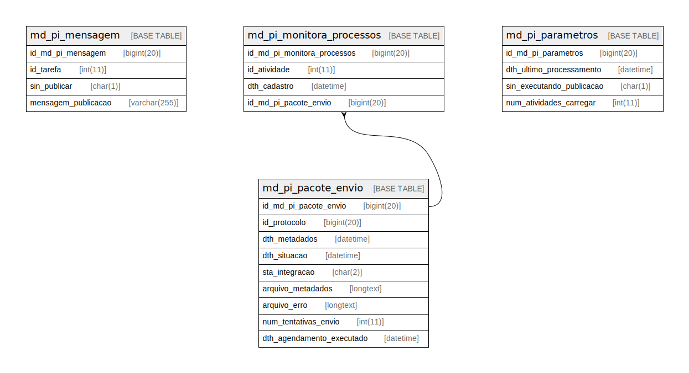

# sei

## Tables

| Name | Columns | Comment | Type |
| ---- | ------- | ------- | ---- |
| [md_pi_mensagem](md_pi_mensagem.md) | 4 |  | BASE TABLE |
| [md_pi_monitora_processos](md_pi_monitora_processos.md) | 4 |  | BASE TABLE |
| [md_pi_pacote_envio](md_pi_pacote_envio.md) | 9 |  | BASE TABLE |
| [md_pi_parametros](md_pi_parametros.md) | 4 |  | BASE TABLE |

## Relations

---

> Generated by [tbls](https://github.com/k1LoW/tbls)
