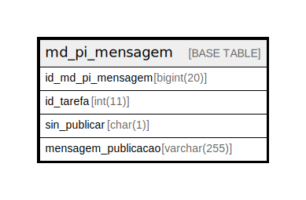

# md_pi_mensagem

## Description

<details>
<summary><strong>Table Definition</strong></summary>

```sql
CREATE TABLE `md_pi_mensagem` (
  `id_md_pi_mensagem` bigint(20) NOT NULL,
  `id_tarefa` int(11) DEFAULT NULL,
  `sin_publicar` char(1) NOT NULL,
  `mensagem_publicacao` varchar(255) NOT NULL,
  PRIMARY KEY (`id_md_pi_mensagem`),
  KEY `i01_md_pi_mensagem` (`id_tarefa`),
  CONSTRAINT `fk_md_pi_mensagem_tarefa` FOREIGN KEY (`id_tarefa`) REFERENCES `tarefa` (`id_tarefa`) ON DELETE CASCADE
) ENGINE=InnoDB DEFAULT CHARSET=latin1 COLLATE=latin1_swedish_ci
```

</details>

## Columns

| Name | Type | Default | Nullable | Children | Parents | Comment |
| ---- | ---- | ------- | -------- | -------- | ------- | ------- |
| id_md_pi_mensagem | bigint(20) |  | false |  |  |  |
| id_tarefa | int(11) | NULL | true |  |  |  |
| sin_publicar | char(1) |  | false |  |  |  |
| mensagem_publicacao | varchar(255) |  | false |  |  |  |

## Constraints

| Name | Type | Definition |
| ---- | ---- | ---------- |
| fk_md_pi_mensagem_tarefa | FOREIGN KEY | FOREIGN KEY (id_tarefa) REFERENCES tarefa (id_tarefa) |
| PRIMARY | PRIMARY KEY | PRIMARY KEY (id_md_pi_mensagem) |

## Indexes

| Name | Definition |
| ---- | ---------- |
| i01_md_pi_mensagem | KEY i01_md_pi_mensagem (id_tarefa) USING BTREE |
| PRIMARY | PRIMARY KEY (id_md_pi_mensagem) USING BTREE |

## Relations



---

> Generated by [tbls](https://github.com/k1LoW/tbls)
