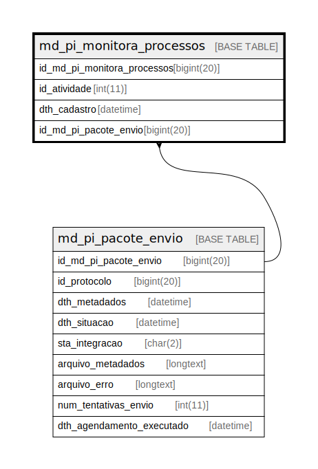

# md_pi_monitora_processos

## Description

<details>
<summary><strong>Table Definition</strong></summary>

```sql
CREATE TABLE `md_pi_monitora_processos` (
  `id_md_pi_monitora_processos` bigint(20) NOT NULL,
  `id_atividade` int(11) NOT NULL,
  `dth_cadastro` datetime DEFAULT NULL,
  `id_md_pi_pacote_envio` bigint(20) NOT NULL,
  KEY `i01_md_pi_monitora_processos` (`id_atividade`),
  KEY `i02_md_pi_monitora_processos` (`id_md_pi_pacote_envio`),
  CONSTRAINT `fk_md_pi_monit_processo_ativ` FOREIGN KEY (`id_atividade`) REFERENCES `atividade` (`id_atividade`),
  CONSTRAINT `fk_md_pi_monit_processo_pacote` FOREIGN KEY (`id_md_pi_pacote_envio`) REFERENCES `md_pi_pacote_envio` (`id_md_pi_pacote_envio`)
) ENGINE=InnoDB DEFAULT CHARSET=latin1 COLLATE=latin1_swedish_ci
```

</details>

## Columns

| Name | Type | Default | Nullable | Children | Parents | Comment |
| ---- | ---- | ------- | -------- | -------- | ------- | ------- |
| id_md_pi_monitora_processos | bigint(20) |  | false |  |  |  |
| id_atividade | int(11) |  | false |  |  |  |
| dth_cadastro | datetime | NULL | true |  |  |  |
| id_md_pi_pacote_envio | bigint(20) |  | false |  | [md_pi_pacote_envio](md_pi_pacote_envio.md) |  |

## Constraints

| Name | Type | Definition |
| ---- | ---- | ---------- |
| fk_md_pi_monit_processo_ativ | FOREIGN KEY | FOREIGN KEY (id_atividade) REFERENCES atividade (id_atividade) |
| fk_md_pi_monit_processo_pacote | FOREIGN KEY | FOREIGN KEY (id_md_pi_pacote_envio) REFERENCES md_pi_pacote_envio (id_md_pi_pacote_envio) |

## Indexes

| Name | Definition |
| ---- | ---------- |
| i01_md_pi_monitora_processos | KEY i01_md_pi_monitora_processos (id_atividade) USING BTREE |
| i02_md_pi_monitora_processos | KEY i02_md_pi_monitora_processos (id_md_pi_pacote_envio) USING BTREE |

## Relations



---

> Generated by [tbls](https://github.com/k1LoW/tbls)
