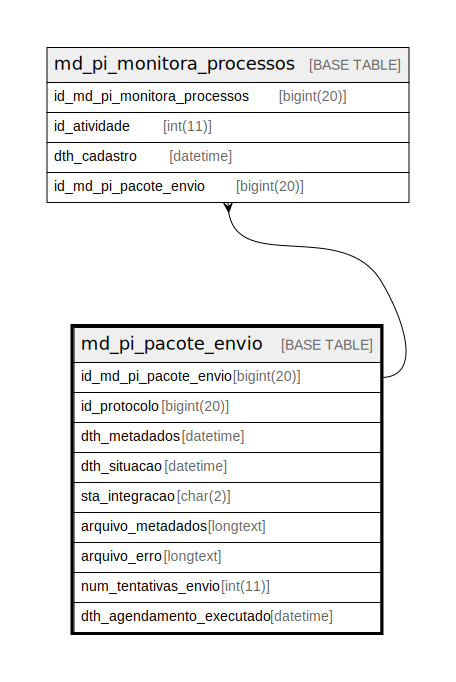

# md_pi_pacote_envio

## Description

<details>
<summary><strong>Table Definition</strong></summary>

```sql
CREATE TABLE `md_pi_pacote_envio` (
  `id_md_pi_pacote_envio` bigint(20) NOT NULL,
  `id_protocolo` bigint(20) NOT NULL,
  `dth_metadados` datetime DEFAULT NULL,
  `dth_situacao` datetime DEFAULT NULL,
  `sta_integracao` char(2) NOT NULL,
  `arquivo_metadados` longtext DEFAULT NULL,
  `arquivo_erro` longtext DEFAULT NULL,
  `num_tentativas_envio` int(11) DEFAULT 0,
  `dth_agendamento_executado` datetime DEFAULT NULL,
  PRIMARY KEY (`id_md_pi_pacote_envio`),
  KEY `fk_md_pacote_pi_protocolo` (`id_protocolo`),
  CONSTRAINT `fk_md_pacote_pi_protocolo` FOREIGN KEY (`id_protocolo`) REFERENCES `protocolo` (`id_protocolo`)
) ENGINE=InnoDB DEFAULT CHARSET=latin1 COLLATE=latin1_swedish_ci
```

</details>

## Columns

| Name | Type | Default | Nullable | Children | Parents | Comment |
| ---- | ---- | ------- | -------- | -------- | ------- | ------- |
| id_md_pi_pacote_envio | bigint(20) |  | false | [md_pi_monitora_processos](md_pi_monitora_processos.md) |  |  |
| id_protocolo | bigint(20) |  | false |  |  |  |
| dth_metadados | datetime | NULL | true |  |  |  |
| dth_situacao | datetime | NULL | true |  |  |  |
| sta_integracao | char(2) |  | false |  |  |  |
| arquivo_metadados | longtext | NULL | true |  |  |  |
| arquivo_erro | longtext | NULL | true |  |  |  |
| num_tentativas_envio | int(11) | 0 | true |  |  |  |
| dth_agendamento_executado | datetime | NULL | true |  |  |  |

## Constraints

| Name | Type | Definition |
| ---- | ---- | ---------- |
| fk_md_pacote_pi_protocolo | FOREIGN KEY | FOREIGN KEY (id_protocolo) REFERENCES protocolo (id_protocolo) |
| PRIMARY | PRIMARY KEY | PRIMARY KEY (id_md_pi_pacote_envio) |

## Indexes

| Name | Definition |
| ---- | ---------- |
| fk_md_pacote_pi_protocolo | KEY fk_md_pacote_pi_protocolo (id_protocolo) USING BTREE |
| PRIMARY | PRIMARY KEY (id_md_pi_pacote_envio) USING BTREE |

## Relations



---

> Generated by [tbls](https://github.com/k1LoW/tbls)
