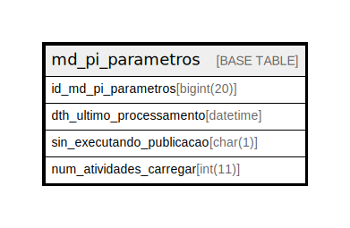

# md_pi_parametros

## Description

<details>
<summary><strong>Table Definition</strong></summary>

```sql
CREATE TABLE `md_pi_parametros` (
  `id_md_pi_parametros` bigint(20) NOT NULL,
  `dth_ultimo_processamento` datetime DEFAULT NULL,
  `sin_executando_publicacao` char(1) DEFAULT 'N',
  `num_atividades_carregar` int(11) DEFAULT NULL,
  PRIMARY KEY (`id_md_pi_parametros`)
) ENGINE=InnoDB DEFAULT CHARSET=latin1 COLLATE=latin1_swedish_ci
```

</details>

## Columns

| Name | Type | Default | Nullable | Children | Parents | Comment |
| ---- | ---- | ------- | -------- | -------- | ------- | ------- |
| id_md_pi_parametros | bigint(20) |  | false |  |  |  |
| dth_ultimo_processamento | datetime | NULL | true |  |  |  |
| sin_executando_publicacao | char(1) | 'N' | true |  |  |  |
| num_atividades_carregar | int(11) | NULL | true |  |  |  |

## Constraints

| Name | Type | Definition |
| ---- | ---- | ---------- |
| PRIMARY | PRIMARY KEY | PRIMARY KEY (id_md_pi_parametros) |

## Indexes

| Name | Definition |
| ---- | ---------- |
| PRIMARY | PRIMARY KEY (id_md_pi_parametros) USING BTREE |

## Relations



---

> Generated by [tbls](https://github.com/k1LoW/tbls)
